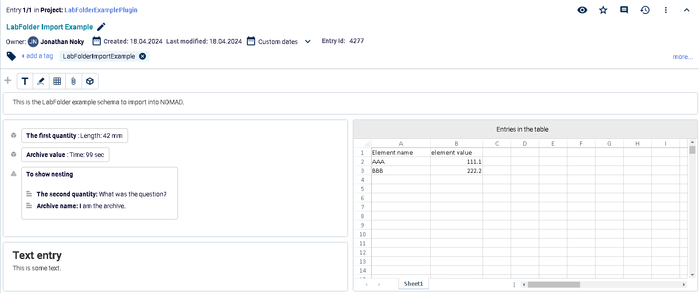
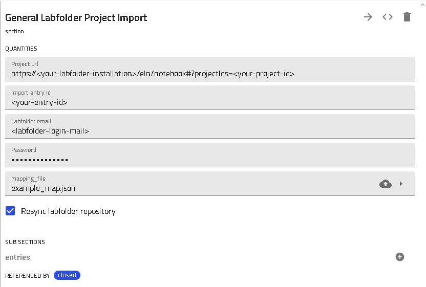
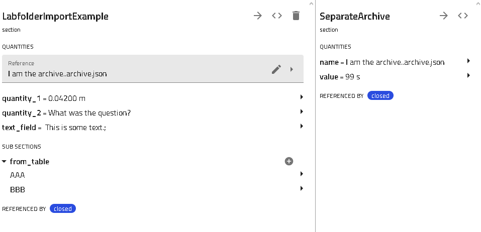

# The Labfolder Import Plugin

This How-to describes the import of an entry from LabFolder to NOMAD via a mapping file. In the first part, the general structure of the import is described, the second part shows a simple example.

## Prerequisites

For an import from LabFolder to NOMAD, the following points have to be met:

- LabFolder entry
- NOMAD with the import plugin and the schema to import to
- Mapping file adapted to both Labfolder ehtry and NOMAD schema

## Importing from LabFolder

In this part, the import from LabFolder in NOMAD is discussed. For the import, the URL of the LabFolder project with the entry to import is needed together with the entry id. The entry id is important for the next step, as LabFolder allows multiple (unrelated) entries per project and the import needs to pick the right one. Also, credentials for the LabFolder installation that can access the respective entry are needed.

For the successful import, a suitable NOMAD schema needs to be created before in combination with a mapping file. Also, the NOMAD installation needs to be able to perform API requests to the LabFolder installation.

### The mapping file

The mapping file for the LabFolder import is a json file consisting of two main blocks:

~~~
{
    'Classes': {
        [...]
    },
    'Mapping': {
        [...]
    }
}
~~~

In the 'Classes' block, all classes used in the NOMAD plugin to import to are defined. Each class entry has the following properties:

~~~
    '<classname>': {
      'class': '<path_to_class>',
      'type': 'main/SubSection/Archive',
      'attribute': '<attribute>',
      'repeats': '<true/false/per line>',
      'name': '<archive_name>'
    }
~~~

- \<classname> is the name of the class used within the mapping file. The name of the main class needs to correspond to one of the tags present in the LabFolder entry to identifythe right main class.

- \<path_to_class> is the full import path of the python class in NOMAD (e.g. cpfs_cvt.cvt.CPFSChemicalVapourTransport).

- \<type> is the type of the class entry, 'Archive' creates a separate archive file for this class. There always has to be exactly one 'main' class.

- \<attribute> defines, to which attribute of the main class the SubSection/Archive belongs. 'main' does not use this.

- \<repeats> defines, if the class is repeatable in the NOMAD plugin. 'per line' is for tables only and creates a new SubSection for each line in that table.

- \<name> is the name of the archive file as stored in NOMAD (only for 'type'='main/Archive'). With 'LF.data.<keys_from_the_LabFolder_template>' dynamic names can be given from the content of the LabFolder template. Several strings can be concatenated with the '+' sign.

In the 'Mapping' block, the structure of the LabFolder entry is mapped to the NOMAD plugin. As LabFolder allows within one entry for elements of different types, each of these types has to be defined separately:

~~~
{
    'Classes': {
        [...]
    },
    'Mapping': {
        'Data elements': {
            [...]
        },
        'Text elements': {
            [...]
        },
        Table elements': {
            [...]
        }
    }
}
~~~

For all elements, the syntax is the following:

~~~
'<field_name_in_LabFolder>': {
    'object': '<classname>',
    'key': '<attribute_of_class>'
}
~~~

- \<field_name_in_LabFolder> is the name of the field in the LabFolder entry. For data elements, it is the element name, for text elements, it is the first line of the text, and for tables (in 'per line' mode) it is the header of the column.

- \<classname> is the name of the class given in the 'Classes' section, where the entry belongs to.

- \<attribute_of_class> defines, to which attribute of the class the element should be assigned.

Nestings of \<field_name_in_LabFolder> are possible and neccessary to map nested data element structures. Also, table elements are always nested with '<table_title>' and '<column_header>'.

### The import process

To import in NOMAD, just create a new upload, choose 'Create from schema', and select the 'General Labfolder Project Import'. In the following page, enter all necessary information as given above together with the mapping file. After saving, new archive files (depending on the mapping file) are created within the upload folder.

## Example

In the following, a minimal example covering the capabilities of the import plugin is shown. To use it, the LabFolder entry has to be created manually in a suitable installation and the NOMAD schema needs to be set up correctly.

### Example LabFolder entry

As a first step, recreate the following LabFolder entry in a LabFolder installation of your choice.

### NOMAD schema

Load the following NOMAD schema into your oasis:

~~~
from nomad.metainfo import (
    Package,
    Quantity,
    SubSection,
)
from nomad.datamodel.data import (
    ArchiveSection,
    EntryData,
)
from nomad.datamodel.metainfo.annotations import (
    ELNAnnotation,
)

m_package = Package(name='LabFolder Import Example')

class RepeatFromTable(ArchiveSection):
    name = Quantity(
        type=str
    )
    value = Quantity(
        type=float,
        unit='g'
    )

class SeparateArchive(EntryData):
    name = Quantity(
        type=str
    )
    value = Quantity(
        type=float,
        unit='s'
    )

class LabfolderImportExample(EntryData):
    quantity_1 = Quantity(
        type=float,
        unit='mm'
    )
    quantity_2 = Quantity(
        type=str
    )
    text_field = Quantity(
        type=str
    )
    from_table = SubSection(
        section_def=RepeatFromTable,
        repeats=True
    )
    reference = Quantity(
        type=SeparateArchive,
        a_eln=ELNAnnotation(
            component='ReferenceEditQuantity',
        )
    )

m_package.__init_metainfo__()
~~~

### The mapping file

The following mapping file links the entries of the LabFolder entry and the NOMAD schema:

~~~
{
    "Classes": {
      "LabFolderImportExample": {
        "class": "labfolder_example_schema.LabfolderImportExample",
        "type": "main",
        "attribute": "",
        "repeats": "false",
        "name": "LabFolderImportExample.archive.json"
      },
      "RepeatingSub": {
        "class": "labfolder_example_schema.RepeatFromTable",
        "type": "SubSection",
        "attribute": "from_table",
        "repeats": "per line",
        "name": ""
      },
      "ArchiveReference": {
        "class": "labfolder_example_schema.SeparateArchive",
        "type": "Archive",
        "attribute": "reference",
        "repeats": "false",
        "name": "LF.data.To show nesting.Archive name+.archive.json"
      }
    },
    "Mapping": {
      "Data elements": {
        "The first quantity": {
          "object": "LabFolderImportExample",
          "key": "quantity_1"
          },
        "Archive value": {
          "object": "ArchiveReference",
          "key": "value"
          },
        "To show nesting": {
          "The second quantity": {
            "object": "LabFolderImportExample",
            "key": "quantity_2"
          },
          "Archive name": {
            "object": "ArchiveReference",
            "key": "name"
          }
        }
      },
      "Text elements": {
        "Text entry": {
          "object": "LabFolderImportExample",
          "key": "text_field"
        }
      },
      "Table elements": {
        "Entries in the table": {
          "Element name": {
            "object": "RepeatingSub",
            "key": "name"
          },
          "element value": {
            "object": "RepeatingSub",
            "key": "value"
          }
        }
      }
    }
  }
  ~~~

  ### Importing the entry into NOMAD

  With all the previous preparations, the import can be done by creating a new upload in NOMAD, select 'Create from schema', and choose the 'General Labfolder Project Import'. In the following page, enter all necessary information as given above together with the mapping file.

  

  After saving, new archive files (depending on the mapping file) are created within the upload folder. The main archive LabFolderImportExample.archive.json now contains all data specified in the mapping:

  